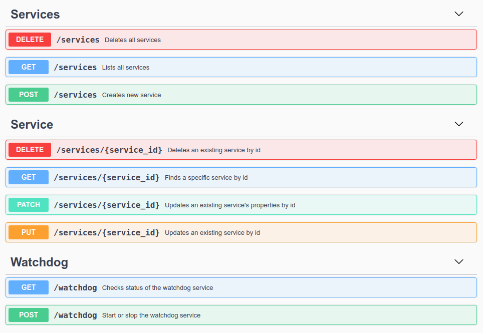

# Monitoring API

[](https://www.python.org/downloads/release/python-377/)
[](https://flask-restful.readthedocs.io/en/latest/)
[](https://docs.celeryproject.org/en/stable/)
[](https://pypi.org/project/celery-redbeat/)
[](http://docs.mongoengine.org/projects/flask-mongoengine/en/latest/)
[](https://marshmallow.readthedocs.io/en/stable/)
[](https://lbesson.mit-license.org/)

> The **Monitoring API** is a simple REST API based on **Flask-RESTful** library. The main purpose of the application is to monitor the availability of selected services. The application checks at regular intervals the availability of services on the specified ip address (or hostname) and port (TCP or UDP).


## Features
* Monitored services data is stored in the **MongoDB** database (details and status of services).
* Service monitoring feature (**watchdog** service) can be activated and deactivated on demand with dedicated endpoint.
* Service monitoring feature (**watchdog** service) is executed as background task with **Celery** (worker), **celery-redbeat** (beat scheduler) and **Redis** (broker and result backend). 
* The application allows the user to add services to be monitored.
* The user can modify and delete selected service. Moreover, it is possible to delete all services from the database with a single endpoint.
* All monitored services can be returned by application.
* Sorting and pagination (cursor-based) functionalities has been implemented. The returned services can be sorted by id (MongoDB `_id`) or name.
* Interactive API documentation with Swagger UI (OpenAPI v2.0 specification)

## Getting Started

Below instructions will get you a copy of the project running on your local machine.

### Requirements
Python third party packages:
* [Flask](https://flask.palletsprojects.com/en/1.1.x/)
* [Flask-RESTful](https://flask-restful.readthedocs.io/en/latest/)
* [Flask-MongoEngine](http://docs.mongoengine.org/projects/flask-mongoengine/en/latest/)
* [Celery](https://docs.celeryproject.org/en/stable/)
* [celery-redbeat](https://pypi.org/project/celery-redbeat/)
* [PyMongo](https://pymongo.readthedocs.io/en/stable/)
* [marshmallow](https://marshmallow.readthedocs.io/en/stable/)
* [flasgger](https://github.com/flasgger/flasgger)
* [python-dotenv](https://pypi.org/project/python-dotenv/)

Other prerequisites:
* The ip address on which the **Monitoring API** will run, should be allowed in the firewall configuration of the monitored host. 
  This is necessary to obtain reliable data about the availability of the monitored services.
* Under the hood application use `netcat` and `nmap` packages to test host's availability. 
  For this reason, it is **recommended** to run the application using the `docker-compose` tool with already prepared dockerfiles.
* If you intend to run the application locally without using `docker-compose` (**not recommended**): 
  - you will need to install the `netcat` and `nmap` packages and allow application to run `nmap` with elevated privileges (e.g by adding an entry `your-username ALL = (ALL) NOPASSWD: /usr/bin/nmap` to `/etc/sudoers`).
  - run the **MongoDB**, **Redis** and **Celery** worker.

  
### Running the app
The recommended way to run application is to build it with `docker-compose` tool.

In order to correctly start the application, you must run the following commands in the project root directory (`monitoring-api`).

1. Before running `docker-compose` command you should create `.env-web`, `.env-mongo`, `.env-express` and `.env-worker` files (ENVs for Flask app and PostgreSQL). The best solution is to copy the existing example files and edit the necessary data.
```bash
# Create required environment files using examples from repository
$ cp docker/web/.env-web-example docker/web/.env-web
$ cp docker/mongo/.env-mongo-example docker/mongo/.env-mongo
$ cp docker/mongo-express/.env-express-example docker/mongo-express/.env-express
$ cp docker/worker/.env-worker-example docker/worker/.env-worker
```
2. Build and start containers using the commands shown below:
```bash
# To build containers specified in docker-compose.yml file
$ docker-compose build
# To start containers (add -d to run them in the background)
$ docker-compose up -d
# To verify status of the application:
$ docker-compose ps
```

3. Open `http://localhost:8080/apidocs` in your browser to see the **Monitoring API** Swagger UI documentation.


4. To open **Mongo Express** (web-based MongoDB admin console) enter in browser `http://localhost:8081`.


5. To stop application run:
```bash
$ docker-compose stop
```

## Monitoring API Endpoints
Below you can find the list of API endpoints (view from Swagger UI).

